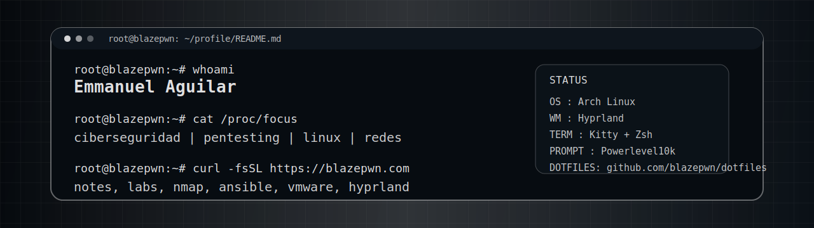

<div align="center">
  
</div>

<p align="center">
  <a href="https://blazepwn.com/"></a>
  <a href="https://blazepwn.com/about/"></a>
  <a href="https://blazepwn.com/rss.xml"></a>
</p>

```console
$ whoami
Emmanuel Aguilar Montano

$ cat about.txt
Ingeniero en Redes Inteligentes y Ciberseguridad.
Blog tecnico sobre ciberseguridad, hacking etico, redes y tecnologia.
```

## ~/foco_actual

<p>
  
  
  
  
  
  
  
</p>

## ~/posts

- [Tratamiento de la TTY](https://blazepwn.com/posts/full-tty/)
- [Nmap - Enumeracion de Servicios](https://blazepwn.com/posts/nmap-service-enumeration/)
- [Nmap - Firewall IDS/IPS Evasion](https://blazepwn.com/posts/nmap-firewall-ids-ips-evasion/)
- [Controla Servidores Ubuntu con Ansible y Playbooks](https://blazepwn.com/posts/ansible/)

## ~/contacto

<p>
  <a href="https://github.com/blazepwn"></a>
  <a href="https://www.linkedin.com/in/blazepwn"></a>
  <a href="https://www.youtube.com/@blazepwn"></a>
  <a href="https://discord.gg/2SGKfsM8Zm"></a>
</p>
