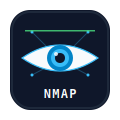

  
  <h1>blazepwn</h1>

 

  <a href="https://blazepwn.com/">website</a> ·
  <a href="https://blazepwn.com/about/">about</a> ·
  <a href="https://blazepwn.com/rss.xml">rss</a>

  <code>ciberseguridad</code>
  <code>pentesting</code>
  <code>linux</code>
  <code>redes</code>
  <code>nmap</code>
  <code>ansible</code>
  <code>hyprland</code>

 

## Posts

- [Tratamiento de la TTY](https://blazepwn.com/posts/full-tty/)
-  [Nmap - Enumeracion de Servicios](https://blazepwn.com/posts/nmap-service-enumeration/)
-  [Nmap - Firewall IDS/IPS Evasion](https://blazepwn.com/posts/nmap-firewall-ids-ips-evasion/)
- [Controla Servidores Ubuntu con Ansible y Playbooks](https://blazepwn.com/posts/ansible/)

 

## Contacto

- [GitHub](https://github.com/blazepwn)
- [LinkedIn](https://www.linkedin.com/in/blazepwn)
- [YouTube](https://www.youtube.com/@blazepwn)
- [Discord](https://discord.gg/2SGKfsM8Zm)
