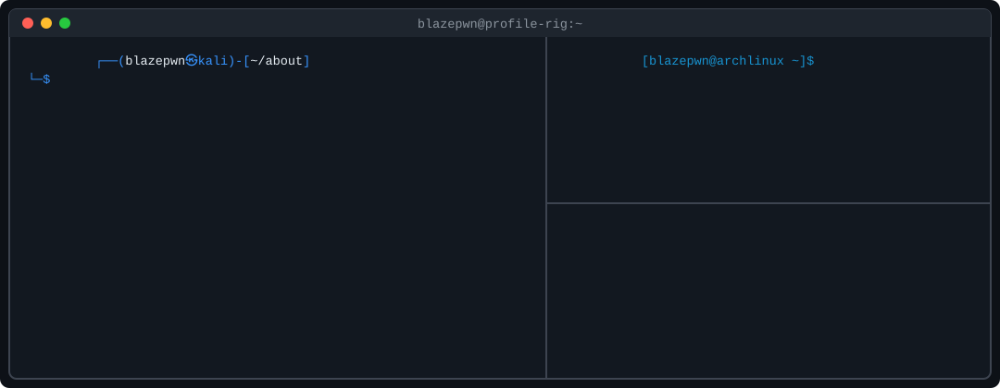

  
   
   
  <h1>blazepwn</h1>
  

  
  
  

  
  

## Sobre mí

- Soy Emmanuel Aguilar Montaño, ingeniero en redes inteligentes y ciberseguridad.
- Comparto contenido técnico en español sobre pentesting, Linux, redes, TTYs y automatización.
- Mi entorno favorito gira alrededor de Arch Linux, Hyprland y `zsh`.

## Posts destacados

| Post | Enfoque |
| --- | --- |
| [Tratamiento de la TTY](https://blazepwn.com/posts/full-tty/) | Estabilización de shells y post-explotación |
| [Nmap - Enumeración de Servicios](https://blazepwn.com/posts/nmap-service-enumeration/) | Reconocimiento y enumeración de servicios |
| [Nmap - Firewall IDS/IPS Evasion](https://blazepwn.com/posts/nmap-firewall-ids-ips-evasion/) | Evasión y escaneo más sigiloso |
| [Controla Servidores Ubuntu con Ansible y Playbooks](https://blazepwn.com/posts/ansible/) | Automatización operativa y administración |

## Actividad en GitHub

  
  

## Conecta conmigo

  
  
  
  

