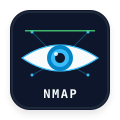

<div align="center">
  
</div>

```bash
$ whoami
blazepwn

$ role
Offensive Security • Pentesting • Linux

$ mission
Convertir teoría en práctica real (enumeración, explotación controlada, automatización y hardening).
```

<p align="left">
  <a href="https://blazepwn.com/">website</a> / <a href="https://blazepwn.com/about/">about</a> / <a href="https://blazepwn.com/rss.xml">rss</a>
</p>

## /focus

- Pentesting y seguridad ofensiva aplicada.
- Enumeración de servicios y superficies de ataque.
- Linux workflows para laboratorios y entornos reales.
- Automatización con Ansible para operaciones repetibles.

## /stack

`linux` `nmap` `ansible` `bash` `redes` `hyprland`

## /latest_posts

- [Tratamiento de la TTY](https://blazepwn.com/posts/full-tty/)
-  [Nmap - Enumeración de Servicios](https://blazepwn.com/posts/nmap-service-enumeration/)
-  [Nmap - Firewall IDS/IPS Evasion](https://blazepwn.com/posts/nmap-firewall-ids-ips-evasion/)
- [Controla Servidores Ubuntu con Ansible y Playbooks](https://blazepwn.com/posts/ansible/)

> Más writeups y guías: [blazepwn.com/posts](https://blazepwn.com/posts/)

## /contact

- [github](https://github.com/blazepwn)
- [linkedin](https://www.linkedin.com/in/blazepwn)
- [youtube](https://www.youtube.com/@blazepwn)
- [discord](https://discord.gg/2SGKfsM8Zm)

```text
"Stay curious. Enumerate first. Exploit later."
```
